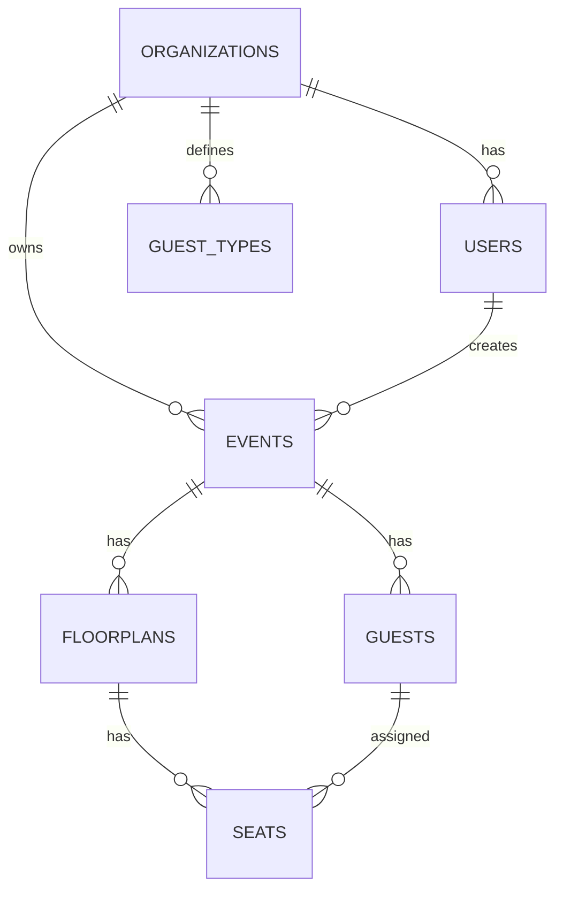

# تحليل معماري شامل لمشروع Seating System (Laravel)

هذا المستند يلخص التحليل الفني للمشروع الحالي، ويقترح هيكلية توسعية قابلة لربط النظام مع نظام فعاليات خارجي متعدد المنظمات.

## 1) نظام المستخدمين والصلاحيات

### الوضع الحالي
- يوجد جدول users فقط بدون جداول roles أو permissions.
- تسجيل الدخول عبر Web Session باستخدام Auth::attempt داخل: [app/Http/Controllers/Auth/LoginController.php](app/Http/Controllers/Auth/LoginController.php)
- الـ Guard المستخدم: web فقط (session) في: [config/auth.php](config/auth.php)
- لا يوجد Multi-tenant حاليا.
- البيانات الخاصة بالأحداث مرتبطة بالمستخدم عبر user_id.
- أنواع الضيوف guest_types مشتركة بين جميع المستخدمين (global).

### الجداول والموديلات والعلاقات
- Migration المستخدمين: [database/migrations/2014_10_12_000000_create_users_table.php](database/migrations/2014_10_12_000000_create_users_table.php)
- Model المستخدم: [app/Models/User.php](app/Models/User.php)
  - User hasMany Events.

### السياسات والميدل وير
- السياسات:
  - EventPolicy: [app/Policies/EventPolicy.php](app/Policies/EventPolicy.php)
  - FloorplanPolicy: [app/Policies/FloorplanPolicy.php](app/Policies/FloorplanPolicy.php)
  - GuestPolicy: [app/Policies/GuestPolicy.php](app/Policies/GuestPolicy.php)
- ربط السياسات في: [app/Providers/AuthServiceProvider.php](app/Providers/AuthServiceProvider.php)
- الميدل وير على المسارات في: [routes/web.php](routes/web.php)
  - auth لمعظم النظام
  - guest لصفحة الدخول
  - throttle:5,1 لطلبات الدخول

## 2) جداول الفعاليات (Events)

### الجدول والحقول
- Migration: [database/migrations/2026_05_05_000001_create_events_table.php](database/migrations/2026_05_05_000001_create_events_table.php)
- الحقول الأساسية:
  - user_id
  - name, type, event_date, location, description
  - preview_token, preview_enabled

### العلاقات
- Event belongsTo User
- Event hasMany Floorplans
- Event hasMany Guests
- Model: [app/Models/Event.php](app/Models/Event.php)

### الإنشاء والإدارة
- EventController ينفذ CRUD:
  - [app/Http/Controllers/EventController.php](app/Http/Controllers/EventController.php)
- المسارات:
  - Route::resource('events', EventController::class) في [routes/web.php](routes/web.php)
- معاينة عامة عبر preview_token:
  - [app/Http/Controllers/EventPreviewController.php](app/Http/Controllers/EventPreviewController.php)
  - Routes في [routes/web.php](routes/web.php)

## 3) جداول الضيوف (Guests)

### الجدول والحقول
- Migration: [database/migrations/2026_05_05_000005_create_guests_table.php](database/migrations/2026_05_05_000005_create_guests_table.php)
- الحقول:
  - event_id
  - guest_type_id (nullable)
  - name, phone, email, notes
- لا يوجد external_id.
- لا يوجد QR أو check-in.

### العلاقات
- Guest belongsTo Event
- Guest belongsTo GuestType
- Guest hasMany Seats
- Model: [app/Models/Guest.php](app/Models/Guest.php)

### Controllers
- إدارة الضيوف: [app/Http/Controllers/GuestController.php](app/Http/Controllers/GuestController.php)
- الاستيراد من Excel: [app/Http/Controllers/GuestImportController.php](app/Http/Controllers/GuestImportController.php)
- أنواع الضيوف: [app/Http/Controllers/GuestTypeController.php](app/Http/Controllers/GuestTypeController.php)

## 4) نظام التجليس (Seating)

### الهيكل الحالي
- المخطط Floorplan يخزن التصميم بالكامل في design_json داخل جدول floorplans.
- جدول seats يخزن المقاعد المفصلة مع guest_id (اختياري).
- لا يوجد جدول للطاولات، بل يتم استخراج المقاعد من JSON.

### الجداول والعلاقات
- floorplans:
  - Migration: [database/migrations/2026_05_05_000002_create_floorplans_table.php](database/migrations/2026_05_05_000002_create_floorplans_table.php)
  - Model: [app/Models/Floorplan.php](app/Models/Floorplan.php)
- seats:
  - Migration: [database/migrations/2026_05_05_000003_create_seats_table.php](database/migrations/2026_05_05_000003_create_seats_table.php)
  - Model: [app/Models/Seat.php](app/Models/Seat.php)

### الخدمات الأساسية
- SeatSyncService: استخراج المقاعد من التصميم وتخزينها.
  - [app/Services/FloorPlanner/SeatSyncService.php](app/Services/FloorPlanner/SeatSyncService.php)
- SeatingAssignmentService: تجليس وإزالة تجليس الضيوف.
  - [app/Services/FloorPlanner/SeatingAssignmentService.php](app/Services/FloorPlanner/SeatingAssignmentService.php)

### الملاحظات المعمارية
- seats.guest_id ليس له FK فعلي إلى guests.id (نقطة ضعف في التكامل المرجعي).

## 5) الـ API الحالية

- ملف المسارات بالكامل: [routes/api.php](routes/api.php)
- يوجد Route وحيد GET /api/user محمي بـ auth:sanctum.
- لا يوجد أي API خاص بالأحداث أو الضيوف أو المخططات.
- لا يوجد JWT/Passport، فقط Sanctum.

## 6) أفضل نقطة للربط مع نظام فعاليات خارجي

### الهدف
الربط مع نظام فعاليات خارجي يحتوي على:
- Organizations/Companies
- Events
- Audience registrations

### التوصية
- إنشاء جدول organizations وربطه بالمستخدمين والأحداث وأنواع الضيوف.
- إضافة external_event_id في events و external_guest_id في guests.
- عزل البيانات على مستوى organization_id.

### تعديلات مقترحة
- users: إضافة organization_id
- events: إضافة organization_id, external_event_id
- guests: إضافة external_guest_id
- guest_types: إضافة organization_id

### علاقات جديدة
- Organization hasMany Users
- Organization hasMany Events
- Organization hasMany GuestTypes
- Event belongsTo Organization
- Guest belongsTo Event

### مزايا هذا النهج
- يدعم العزل الكامل لكل Organization.
- يسمح بالمزامنة التلقائية للأحداث والضيوف.
- يحافظ على نظام التجليس محليا داخل المشروع.

## 7) ERD مقترح (بعد الربط)

## 8) ملفات أساسية ومشاكل حالية واقتراح Refactoring

### ملفات مهمة
- Models:
  - [app/Models/User.php](app/Models/User.php)
  - [app/Models/Event.php](app/Models/Event.php)
  - [app/Models/Floorplan.php](app/Models/Floorplan.php)
  - [app/Models/Guest.php](app/Models/Guest.php)
  - [app/Models/Seat.php](app/Models/Seat.php)
  - [app/Models/GuestType.php](app/Models/GuestType.php)
- Controllers:
  - [app/Http/Controllers/EventController.php](app/Http/Controllers/EventController.php)
  - [app/Http/Controllers/FloorplanController.php](app/Http/Controllers/FloorplanController.php)
  - [app/Http/Controllers/FloorplanEditorController.php](app/Http/Controllers/FloorplanEditorController.php)
  - [app/Http/Controllers/GuestController.php](app/Http/Controllers/GuestController.php)
  - [app/Http/Controllers/GuestImportController.php](app/Http/Controllers/GuestImportController.php)
  - [app/Http/Controllers/GuestTypeController.php](app/Http/Controllers/GuestTypeController.php)

### المشاكل المعمارية الحالية
- لا يوجد Multi-tenant.
- guest_types مشتركة بين جميع المستخدمين.
- seats.guest_id بدون FK.
- API تكامل ضعيف جدا.

### Refactoring احترافي مقترح
- إضافة organizations وعزل البيانات.
- إضافة external_event_id و external_guest_id.
- جعل guest_types مرتبطة بالمنظمة.
- إضافة Scopes أو Middleware لعزل البيانات تلقائيا.
- بناء API للتزامن الخارجي باستخدام Sanctum.
