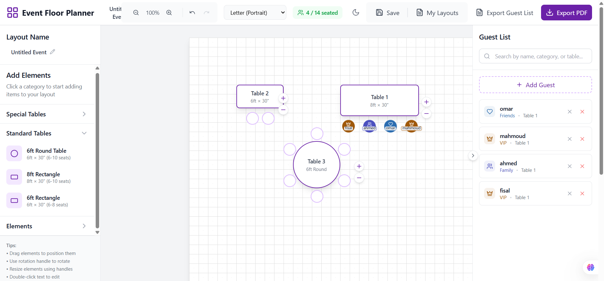

# Project Plan Reference

This file contains the full product plan and implementation prompt for the Arabic Event Floor Planner project. Use it as a reference together with AGENTS.md and the skill files.

You are a senior Laravel 10 full-stack engineer and product planner.

I want you to help me design and implement a web application similar in concept to Event Floor Planner, but simpler and not over-engineered. This is NOT a big SaaS platform. It will be used internally by one company only. I want the project to look modern, smooth, and professional, but the architecture should stay simple and maintainable.

The project language and UI must be Arabic, with full RTL support.

Project Name:
Arabic Event Floor Planner / Seating Floor Planner

Main Tech Stack:
- Laravel 10
- MySQL
- Blade for normal pages
- Vue 3 only for the floor plan editor page
- Konva.js for canvas, drag and drop, resizing, rotation, and layout editing
- Laravel Excel for importing guests from Excel
- DomPDF for PDF export
- Vite for frontend build
- Bootstrap / Tailwind CSS is acceptable, but keep it clean and simple
- The project must be one Laravel project, not separated into backend and frontend projects

Important hosting constraint:
The final project may be deployed on shared hosting such as GoDaddy where npm may not be available on the server. So Vue/Vite assets must be built locally using npm run build, and the generated public/build folder should be uploaded to the server. Do not rely on npm, Node.js, Puppeteer, Browsershot, or Chrome on production hosting.

General Goal:
Build an internal event floor planning system where the company can:
1. Create events
2. Create one or more floor plans for each event
3. Define the hall size
4. Optionally upload a background image of the hall/floor plan
5. Draw or add walls, doors, stage, tables, chairs, aisles, VIP areas, and other elements
6. Add guests manually or import them from Excel
7. Categorize guests by type, such as Normal, VIP, Family, Friends, Staff, etc.
8. Drag guests from the guest list and assign them to seats
9. Show the guest name visually on/near the seat
10. Show the guest’s assigned table and seat in the guest list
11. Export the final floor plan as PDF
12. Export the guest seating list as Excel or PDF

Please first create a complete plan before writing code. I want a clear, step-by-step implementation plan, database design, routes, controllers, Vue component structure, user flow, and review checklist.

Do not over-engineer the project.
Avoid:
- Multi-tenant SaaS complexity
- Subscription plans
- Billing
- Complex organizations hierarchy
- Microservices
- Separate frontend app
- Complex permissions system unless needed
- WebSockets unless absolutely necessary
- Heavy infrastructure requirements

Use a simple structure:
- One company
- Admin users and optional staff users
- Internal dashboard
- Events
- Floor plans
- Guests
- Guest types
- Seating assignments
- PDF/Excel exports

The UI should be modern and close to the provided reference concept:
- Top toolbar
- Left sidebar for layout elements
- Center canvas/grid editor
- Right sidebar for guest list
- Arabic labels
- RTL layout
- Smooth drag and drop
- Clean colors, preferably purple accents
- Responsive enough for desktop/tablet, but the editor can be desktop-first

Main Screens:

1. Login / Register
Use Laravel auth. Simple and clean.

2. Dashboard
Show:
- Total events
- Upcoming events
- Total guests
- Recent floor plans
- Button to create a new event

3. Events List
Arabic UI.
Features:
- Add event
- Edit event
- Delete event
- Search events
- Open event details

Event fields:
- name
- type
- event_date
- location
- description

4. Event Details Page
Show:
- Event information
- Floor plans list
- Guests list
- Buttons:
  - Add floor plan
  - Open editor
  - Manage guests
  - Import guests from Excel
  - Export guest list

5. Create Floor Plan Page
Fields:
- Floor plan name
- Hall width
- Hall height
- Unit: meter or foot
- Paper size for export: A4, Letter
- Orientation: portrait or landscape
- Optional background image upload
- Grid size setting, optional

6. Floor Plan Editor Page
This is the most important part.

Use:
- Blade page that mounts a Vue 3 component
- Vue 3 component contains Konva.js canvas
- Data loaded from Laravel API endpoints
- Save layout as JSON in MySQL
- Also store seats separately if needed for reporting and guest assignment

Editor Layout:

Top toolbar:
- Layout name
- Zoom in / zoom out
- Zoom percentage
- Undo / Redo
- Paper size selector
- Seated count, example: 4 / 14 seated
- Save button
- My layouts button
- Export guest list button
- Export PDF button

Left sidebar:
Title: إضافة عناصر
Categories:
- طاولات
- كراسي
- مسرح
- حوائط
- أبواب
- ممرات
- مناطق VIP
- إضاءة وصوت
- عناصر أخرى

Table types:
- Round table
- Rectangle table
- Square table
- Long banquet table
- Theater rows
- Custom table

When adding a table:
The user should choose:
- Table name / number
- Table shape
- Number of seats
- Table size
- Color
- Category/type, optional
- Seat numbering style

The system should automatically place seats around the table based on table shape and seat count.

Examples:
- Round table with 8 seats: seats distributed around the circle
- Rectangle table with 10 seats: seats distributed along both long sides and optional ends
- Theater row: seats in straight rows
- Stage: rectangle element with label

Canvas area:
- Grid background
- Optional uploaded background image
- Drag elements
- Resize elements
- Rotate elements
- Select element
- Delete element
- Duplicate element
- Multi-select if practical
- Snap to grid if practical
- Zoom and pan
- Prevent or warn about overlap if practical
- Save layout as JSON

Right sidebar:
Guest List:
- Search by name, category, table
- Add guest button
- Guest cards with icon/color based on type
- Guest name
- Guest type
- Assigned table name
- Assigned seat number
- Remove assignment button
- Delete guest button

Guest seating:
- User can drag a guest from the right sidebar and drop onto an empty seat
- Seat becomes assigned
- Guest name appears visually on or near the seat
- Guest card updates with table and seat
- Prevent assigning two guests to the same seat
- Prevent assigning the same guest to multiple seats unless reassigned
- Allow unassigning guest from seat

7. Guests Management
Guest fields:
- name
- phone
- email
- guest_type_id
- notes
- assigned floor plan, optional
- assigned table, optional
- assigned seat, optional

Guest Types:
Default guest types:
- عادي
- VIP
- عائلة
- أصدقاء
- موظف
- إعلام
- راعي
- ذوي احتياجات خاصة

Allow admin to add/edit/delete guest types:
- Arabic name
- icon
- color
- priority/order

8. Excel Import
Use Laravel Excel.

User can upload Excel file with columns:
- name
- phone
- email
- type
- notes

The import process should:
- Show a preview before final import if possible
- Validate required name field
- Create guest type automatically if it does not exist, or map to existing type
- Avoid duplicate guests if same name + phone/email exists
- Show success and error summary

9. Exports

PDF Floor Plan Export:
Use DomPDF or image export from canvas sent to Laravel.
Important:
- Since DomPDF may not perfectly render canvas directly, the Vue editor should be able to export the Konva canvas as an image data URL.
- Send the image to Laravel.
- Laravel generates a PDF containing:
  - Event name
  - Floor plan name
  - Date
  - Hall size
  - Seating count
  - The floor plan image
  - Optional guest summary

Guest List Export:
Export Excel or PDF with:
- Guest name
- Guest type
- Table name
- Seat number
- Notes

10. Database Design
Please propose migrations for these tables:

users
events
floorplans
floorplan_elements, if needed
tables, if needed
seats
guests
guest_types
seating_assignments, if needed
media/uploads, if needed

Suggested simpler approach:
- Save full editor layout JSON in floorplans.design_json
- Store generated seats in seats table for assignment/reporting
- Store guest assignments clearly in seats.guest_id or seating_assignments table

Please recommend the best simple approach and explain why.

11. Suggested Models and Relationships
Please define Eloquent models and relationships:
- User has many Events
- Event belongs to User
- Event has many Floorplans
- Event has many Guests
- Event has many GuestTypes
- Floorplan belongs to Event
- Floorplan has many Seats
- Guest belongs to Event
- Guest belongs to GuestType
- Seat belongs to Floorplan
- Seat belongs to Guest nullable

12. Routes and Controllers
Please propose clean Laravel routes:
- EventController
- FloorplanController
- FloorplanEditorController
- GuestController
- GuestTypeController
- GuestImportController
- ExportController

For the editor, use JSON API endpoints:
- GET floorplan data
- POST save layout
- POST assign guest to seat
- POST unassign guest
- POST export canvas image to PDF

13. Vue/Konva Editor Architecture
Please propose component structure:
resources/js/editor/
- EditorApp.vue
- components/TopToolbar.vue
- components/LeftLibrary.vue
- components/CanvasStage.vue
- components/RightGuestList.vue
- components/TableElement.vue, if needed
- components/SeatElement.vue, if needed
- composables/useEditorState.js
- composables/useSeats.js
- composables/useHistory.js
- services/editorApi.js

Important:
Keep Vue only for the editor page.
Other pages can be normal Laravel Blade.

14. Important UX Details
The Arabic UI should feel polished:
- RTL layout
- Arabic buttons and labels
- Smooth hover states
- Clear icons
- Empty states
- Toast notifications
- Save status: saved / unsaved changes
- Confirm before leaving if there are unsaved changes
- Loading indicators
- Error messages in Arabic

15. Development Phases
Please break the project into clear phases:

Phase 1:
Laravel setup, auth, layout, dashboard.

Phase 2:
Events CRUD and event details page.

Phase 3:
Floorplan CRUD, hall size, background image upload.

Phase 4:
Basic editor page with Vue + Konva:
- grid
- add table
- move table
- save JSON
- load JSON

Phase 5:
Table builder:
- table shape
- number of seats
- automatic seat placement
- table labels
- seat labels

Phase 6:
Guests and guest types:
- CRUD
- right sidebar
- search/filter

Phase 7:
Drag guest to seat:
- assign
- unassign
- show name
- seated counter

Phase 8:
Excel import.

Phase 9:
PDF floor plan export and guest list export.

Phase 10:
Polish, validation, testing, deployment checklist.

16. Testing and Review
Please create a review checklist for each phase:
- Functional checks
- UI checks
- Data validation checks
- Security checks
- Arabic/RTL checks
- Export checks

17. Security Requirements
- Use Laravel auth middleware
- Users can only access their own events/floorplans, unless admin
- Validate all inputs
- Validate uploaded images and Excel files
- Limit file size
- Protect API routes with auth
- CSRF handling
- Authorization policies if needed

18. Performance Requirements
Keep it lightweight:
- Do not save to database after every pixel movement unless autosave is debounced
- Save layout JSON on button click and optional autosave every 30 seconds
- Optimize large background images
- Avoid huge JSON when possible
- Use pagination/search for large guest lists

19. Deployment Requirements
The project should be deployable to shared hosting.
Please provide deployment steps:
Local:
- composer install
- npm install
- npm run build
- php artisan migrate
- php artisan storage:link

Production:
- Upload project files
- Upload vendor or run composer if available
- Upload public/build
- Configure .env
- Configure database
- Set APP_ENV=production
- Run cache commands if SSH is available
- Use DomPDF, not Browsershot

20. Final Output Required From You
Before coding, give me:
1. Complete product plan
2. Recommended architecture
3. Database schema
4. Route list
5. Controller list
6. Vue component structure
7. Implementation roadmap
8. Review checklist
9. Risks and simple solutions
10. Deployment plan for shared hosting

After I approve the plan, start implementation step by step.
Do not write everything at once.
Work phase by phase.
After each phase, give me:
- What was implemented
- Files changed
- How to test it
- What to review before moving to next phase

Remember:
The project must be simple, clean, internal-use only, Arabic RTL, visually modern, and close to an Event Floor Planner interface

Use the attached screenshot only as a visual reference for layout direction, not as an exact copy.
.